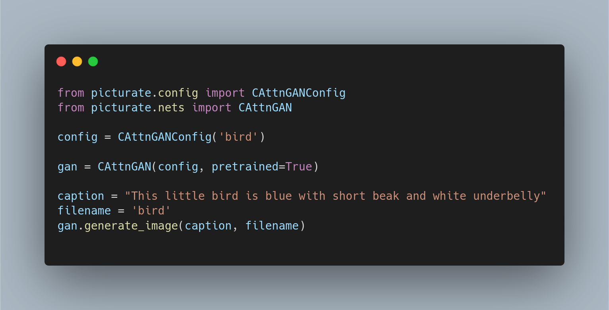

	<h2 align="center"> Picturate </h2>
	<h4 align="center"> Text to image synthesis engine  <h4>

* * * * *
>**Note: This library is still work in progress**
    All contributions are welcome
    If you need a model to be added in our library please create an issue for it

* * * * *

## Why we built this

* Through this library we want to consolidate the code most of the popular text to image GANs and their pretrained models

* Researchers should be able to quickly reproduce and replicate the existing text to image GANs

* With our metrics functions researchers can easily benchmark their model with other GANs

## Example usage

## Model Zoo

| Model Class | Name | Paper Link |
|:-----------:|:---------------------------------------------:|:-------------:|
| CAttnGAN | Cycle Attention GAN | [arxiv](https://arxiv.org/abs/2003.12137) |

## References

[[1] Cycle Attention GAN Implementation](https://github.com/suetAndTie/cycle-image-gan)